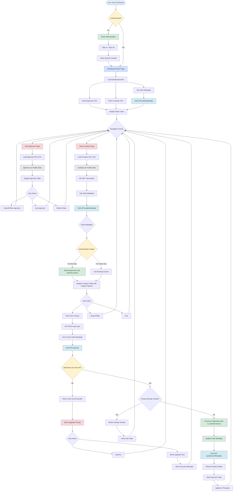

```mermaid
flowchart TB
    Start([User Visits Dashboard]) --> Auth{Authenticated?}
    
    Auth -->|No| ClerkAuth[Clerk Authentication]
    ClerkAuth --> SignIn[Sign In / Sign Up]
    SignIn --> SessionCreated[Clerk Session Created]
    SessionCreated --> Dashboard
    
    Auth -->|Yes| Dashboard[Dashboard Home Page]
    Dashboard --> LoadStats[Load Dashboard Stats]
    LoadStats --> FetchCSV1[Fetch Agencies CSV]
    LoadStats --> FetchCSV2[Fetch Contacts CSV]
    LoadStats --> GetMetadata1[Get Clerk Metadata]
    GetMetadata1 --> ClerkAPI1[Clerk API publicMetadata]
    FetchCSV1 --> DisplayStats[Display Stats Cards]
    FetchCSV2 --> DisplayStats
    ClerkAPI1 --> DisplayStats
    DisplayStats --> NavChoice{Navigation Choice}
    
    NavChoice --> Agencies[View Agencies Page]
    NavChoice --> Contacts[View Contacts Page]
    
    Agencies --> LoadAgencies[Load Agencies from CSV]
    LoadAgencies --> AgenciesCSV[agencies.csv Public Data]
    AgenciesCSV --> DisplayAgencies[Display Agencies Table]
    DisplayAgencies --> AgencyActions{User Action}
    AgencyActions --> Search1[Search/Filter Agencies]
    AgencyActions --> Sort1[Sort Agencies]
    AgencyActions --> Refresh1[Refresh Data]
    Search1 --> NavChoice
    Sort1 --> NavChoice
    Refresh1 --> NavChoice
    
    Contacts --> LoadContacts[Load Contacts from CSV]
    LoadContacts --> ContactsCSV[contacts.csv Public Data]
    ContactsCSV --> CheckStatus[API GET view-status]
    CheckStatus --> GetMetadata2[Get Clerk Metadata]
    GetMetadata2 --> ClerkAPI2[Clerk API publicMetadata]
    ClerkAPI2 --> ParseMetadata{Parse Metadata}
    
    ParseMetadata --> CheckDate{lastResetDate Today?}
    CheckDate -->|No New Day| ResetCounters[Reset dailyViews and viewedContacts]
    CheckDate -->|Yes Same Day| UseExisting[Use Existing Counts]
    ResetCounters --> DisplayTable
    UseExisting --> DisplayTable
    
    DisplayTable[Display Contacts Table with Usage Progress]
    DisplayTable --> ContactActions{User Action}
    
    ContactActions --> ViewContact[Click View Contact]
    ContactActions --> Search2[Search/Filter]
    ContactActions --> Sort2[Sort]
    Search2 --> NavChoice
    Sort2 --> NavChoice
    
    ViewContact --> TrackView[API POST track-view]
    TrackView --> GetCurrentMeta[Get Current Clerk Metadata]
    GetCurrentMeta --> ClerkAPI3[Clerk API getUser]
    ClerkAPI3 --> ValidateLimit{dailyViews less than 50?}
    
    ValidateLimit -->|No| LimitExceeded[Return 403 Limit Exceeded]
    LimitExceeded --> ShowUpgrade[Show Upgrade Prompt]
    ShowUpgrade --> UpgradeAction{User Action}
    UpgradeAction --> Dismiss[Dismiss]
    UpgradeAction --> MockUpgrade[Mock Upgrade Flow]
    MockUpgrade --> SuccessMsg[Show Success Message]
    Dismiss --> NavChoice
    SuccessMsg --> NavChoice
    
    ValidateLimit -->|Yes| CheckViewed{Contact Already Viewed?}
    CheckViewed -->|Yes| AlreadyViewed[Return Already Viewed]
    AlreadyViewed --> ShowInfo[Show Info Toast]
    ShowInfo --> NavChoice
    
    CheckViewed -->|No| IncrementView[Increment dailyViews Add to viewedContacts]
    IncrementView --> UpdateMeta[Update Clerk Metadata]
    UpdateMeta --> ClerkAPI4[Clerk API updateUserMetadata]
    ClerkAPI4 --> RevealContact[Reveal Contact Details]
    RevealContact --> ShowSuccess[Show Success Toast]
    ShowSuccess --> UpdateUI[Update UI Progress]
    UpdateUI --> NavChoice
    
    style Start fill:#e1f5ff
    style Auth fill:#fff3cd
    style ClerkAuth fill:#d4edda
    style Dashboard fill:#cfe2ff
    style Agencies fill:#f8d7da
    style Contacts fill:#f8d7da
    style CheckDate fill:#fff3cd
    style ValidateLimit fill:#fff3cd
    style ShowUpgrade fill:#f8d7da
    style AgenciesCSV fill:#e7e7e7
    style ContactsCSV fill:#e7e7e7
    style ClerkAPI1 fill:#d1ecf1
    style ClerkAPI2 fill:#d1ecf1
    style ClerkAPI3 fill:#d1ecf1
    style ClerkAPI4 fill:#d1ecf1
    style ResetCounters fill:#d4edda
    style IncrementView fill:#d4edda
    style UpdateMeta fill:#d4edda
```